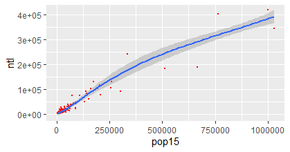

# Project 2: Dominican Republic

Matt Howat

## Part 1: Acquiring, Modifying and Describing the Data

### NTL and Population Graph

The graph shows the variables NTL and the Population of the Dominican Republic
The R^2 value of this graph is .9198

### Covariates and Population Graph

The graph shows the covariates (this includes water, topography, slope, etc.) and the Population
The R^2 value of this graph is .9246

### Covariates and Log of the Population Graph

The graph shows the covariates aforementioned and the population
The R^2 value of this graph is .9246 as well despite the graph looking very different

## Part 2: Modeling and Predicting Spatial Values

### Difference between the estimated population and the actual population

The plot shows the difference between what the model believes is the population and the actual population in the Dominican Republic

### Open source street view of the population difference in Santo Domingo
.png)

The plot shows the same information as the previouse however it is more specific to Santo Domingo, the capital of the Dominican Republic, and overlayed the open street view

## Best Results

I believe that the best graph was the graph comparing population to the log of the covariates. I chose this to be the best graph because of its ability to show how off each data point is from the line of best fit. The log seems to make the data more readable, changing the scale for the residual so that is between -3 and 2. The easy of convaying information accompanied by the fact that there was a lower maginitude make it the best to represent the data. The plot that showed the most potential for convaying the difference between the estimated value and the actual value is the one that is masked to only show Santo Domingo. The smaller area allows for us to show the street view underneath, giving the person reading the map a better idea of the land they are looking at, and in turn a better understanding of the plot as a whole. 

